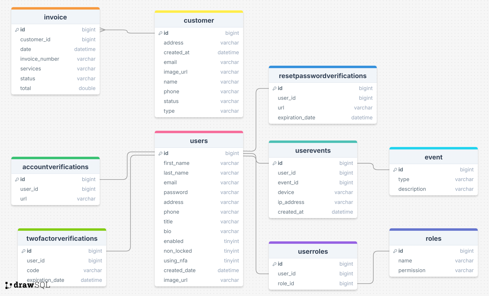

# Customer Management

Fullstack Customer Management Application is a comprehensive web-based solution designed to efficiently manage customer interactions and requests. 

Key Features:

* User Management: Allows for seamless user authentication and authorization, enabling different user roles to access specific functionalities.

* Service Request Management: Provides a streamlined process for customers to submit and track service requests, while administrators can efficiently manage and respond to these requests.

* Robust Security: Implements multi-factor authentication using email and Twilio services to enhance account security. Detailed account activity logs are maintained to ensure traceability and accountability.

* User-Friendly Interface: Built with Angular and TypeScript, the application offers a responsive and intuitive interface for easy navigation and interaction.

* Error Handling: Effective exception handling mechanisms are in place to address errors on both the front-end and back-end, guaranteeing a seamless user experience.

### Built With

This project was built using the following languages, frameworks, and libraries:

* [![Spring Boot][SpringBoot.com]][SpringBoot-url]
* [![Angular][Angular.io]][Angular-url]
* [![TypeScript][TypeScript.io]][TypeScript-url]
* [![Bootstrap][Bootstrap.com]][Bootstrap-url]
* [![MySQL][MySQL.com]][MySQL-url]
* [![Docker][Docker.com]][Docker-url]

## Screenshots
Application

Database

## Demo

Thanks for reading! =)

<!-- MARKDOWN LINKS & IMAGES -->
[SpringBoot.com]: https://img.shields.io/badge/spring-%236DB33F?style=for-the-badge&logo=spring&logoColor=white
[SpringBoot-url]: https://www.mysql.com/
[TypeScript.io]: https://img.shields.io/badge/typescript-%233178C6?style=for-the-badge&logo=typescript&logoColor=white
[TypeScript-url]: https://www.typescriptlang.org/
[Docker.com]: https://img.shields.io/badge/docker-%232496ED?style=for-the-badge&logo=docker&logoColor=white
[Docker-url]: https://www.docker.com/
[MySQL.com]: https://img.shields.io/badge/mysql-%234479A1?style=for-the-badge&logo=mysql&logoColor=white
[MySQL-url]: 'https://www.mysql.com/'
[Angular.io]: https://img.shields.io/badge/Angular-DD0031?style=for-the-badge&logo=angular&logoColor=white
[Angular-url]: https://angular.io/
[Bootstrap.com]: https://img.shields.io/badge/Bootstrap-563D7C?style=for-the-badge&logo=bootstrap&logoColor=white
[Bootstrap-url]: https://getbootstrap.com
 